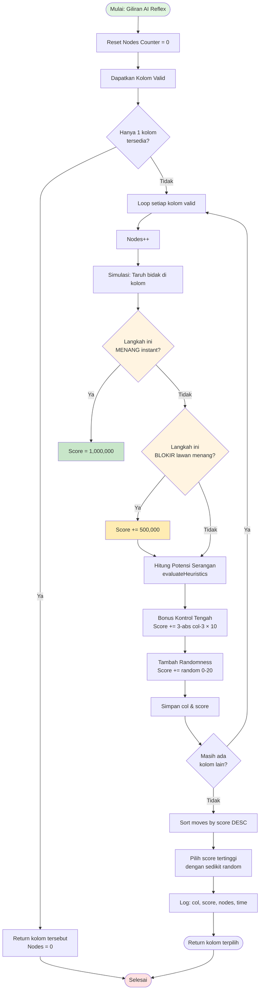
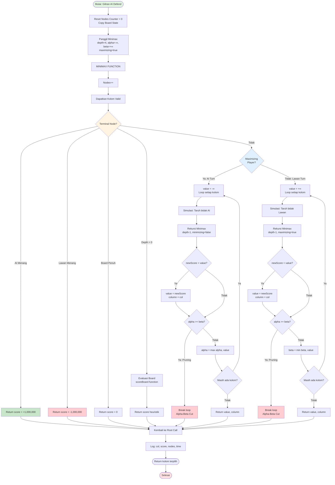
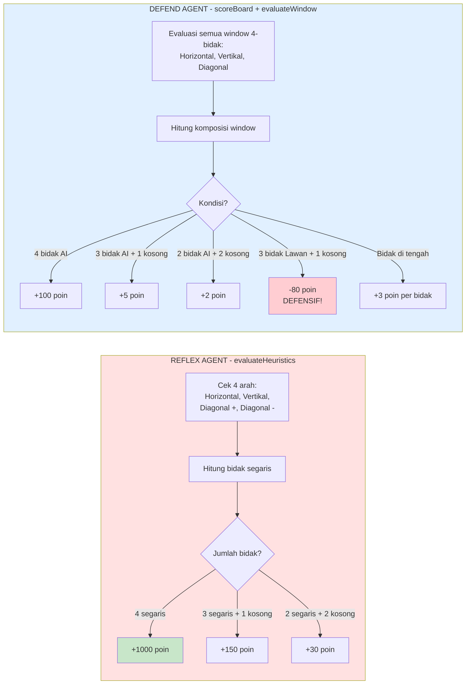
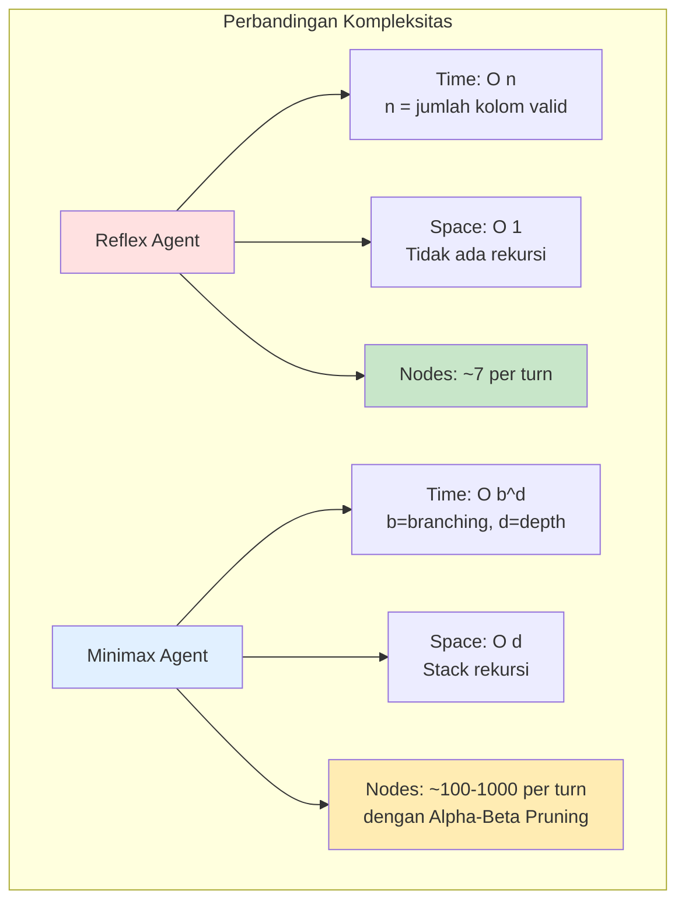
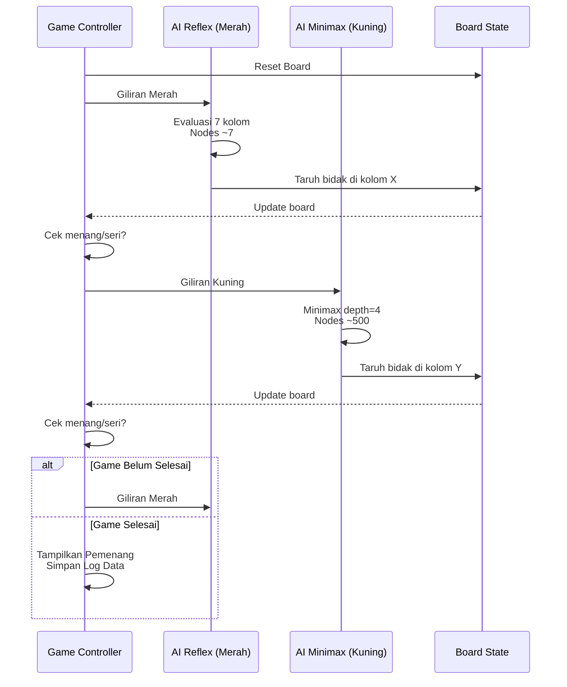

# Flowchart Algoritma AI - Connect Four

## 1. Reflex Agent (Greedy Heuristic)

---

## 2. Defend Agent (Minimax + Alpha-Beta Pruning)

---

## 3. Perbandingan Evaluasi Heuristik

---

## 4. Kompleksitas Algoritma

---

## 5. Flow Game AI vs AI

---

## Penjelasan Perbedaan Utama

| Aspek                  | Reflex Agent                    | Minimax Agent                        |
| ---------------------- | ------------------------------- | ------------------------------------ |
| **Depth Pencarian**    | 0 (hanya evaluasi langsung)     | 4 (simulasi 4 langkah ke depan)      |
| **Nodes Explored**     | ~7 nodes/turn                   | ~100-1000 nodes/turn                 |
| **Waktu Eksekusi**     | <5ms                            | 50-500ms                             |
| **Strategi**           | Greedy (pilih terbaik sekarang) | Optimal (asumsi lawan main sempurna) |
| **Kompleksitas**       | O(n) - Linear                   | O(b^d) - Exponential                 |
| **Tipe Agent**         | Simple Reflex Agent             | Goal-Based Agent                     |
| **Prediksi Lawan**     | Tidak ada                       | Ada (minimizing player)              |
| **Alpha-Beta Pruning** | Tidak ada                       | Ada (efisiensi)                      |

---

## Kesimpulan untuk Karya Ilmiah

**Kedua algoritma sudah SEIMBANG dan SESUAI** karena:

1. ✅ **Perbedaan filosofi jelas**: Reaktif vs Prediktif
2. ✅ **Kompleksitas berbeda signifikan**: Linear vs Exponential
3. ✅ **Trade-off yang jelas**: Speed vs Accuracy
4. ✅ **Implementasi standar**: Sesuai literatur AI (Russell & Norvig)

**Tidak perlu mengubah skor evaluasi** - perbedaan performa akan terlihat dari:

- Win rate (%)
- Nodes explored
- Waktu eksekusi
- Kualitas keputusan strategis
